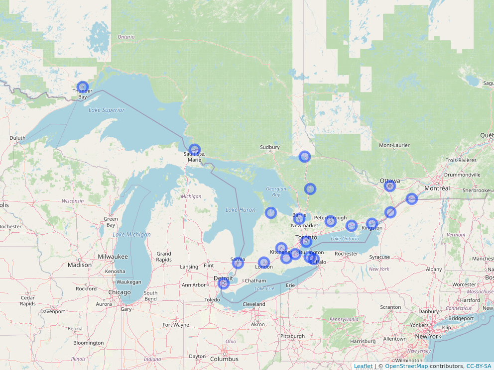
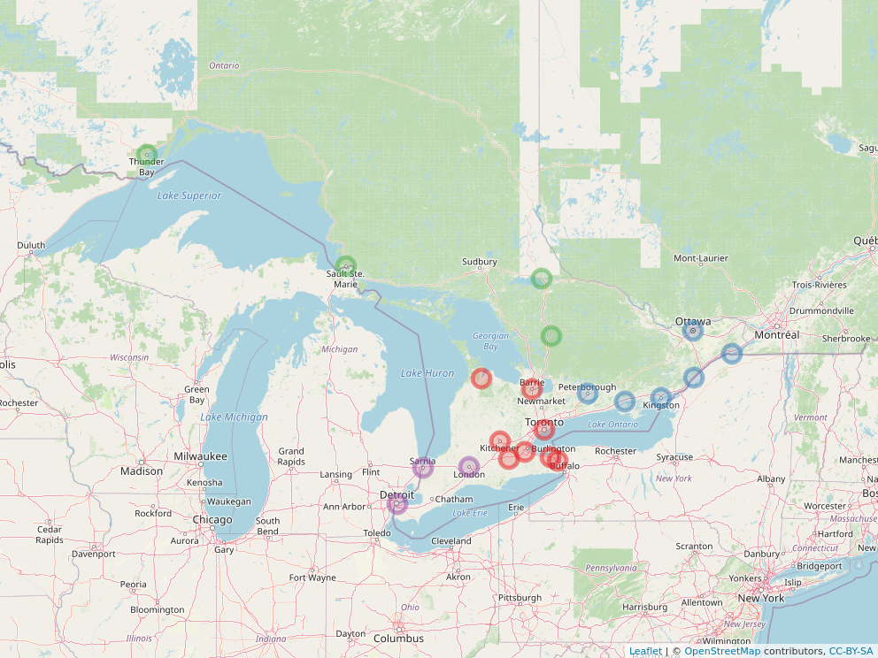

## Cluster Analysis


* One side-effect of discriminant analysis: could draw picture of data (if 1st 2s `LD`s told most of story) and see which individuals "close" to each other.

* Discriminant analysis requires knowledge of groups.

* Without knowledge of groups, use *cluster analysis*: see which individuals close together, which groups suggested by data.

* Idea: see how individuals group into "clusters" of nearby individuals.

* Base on "dissimilarities" between individuals.

* Or base on standard deviations and correlations between variables (assesses dissimilarity behind scenes).


## Packages
```{r, eval=F}
library(MASS) # for lda later
library(tidyverse)
library(spatstat) # for crossdist later
library(ggrepel)
```

   


## One to ten in 11 languages
\begin{tabular}{lcccccc}
& English & Norwegian & Danish & Dutch & German\\
\hline
1 & one & en & en & een & eins\\
2 & two & to & to & twee & zwei\\
3 & three & tre & tre & drie & drei\\
4 & four & fire & fire & vier & vier\\
5 & five & fem & fem & vijf & funf\\
6 & six & seks & seks & zes & sechs\\
7 & seven & sju & syv & zeven & sieben\\
8 & eight & atte & otte & acht & acht\\
9 & nine & ni & ni & negen & neun\\
10 & ten & ti & ti & tien & zehn\\
\hline
\end{tabular}


## One to ten
\begin{small}
\begin{tabular}{lcccccc}
& French & Spanish & Italian & Polish & Hungarian & Finnish\\
\hline
1 & un & uno & uno & jeden & egy & yksi\\
2 & deux & dos & due & dwa & ketto & kaksi\\
3 & trois & tres & tre & trzy &  harom & kolme\\
4 & quatre & cuatro & quattro & cztery & negy & nelja\\
5 & cinq & cinco & cinque & piec & ot & viisi\\
6 & six & seis & sei & szesc & hat & kuusi\\
7 & sept & siete & sette & siedem & het & seitseman \\
8 & huit & ocho & otto & osiem & nyolc & kahdeksan\\
9 & neuf & nueve & nove & dziewiec & kilenc & yhdeksan \\
10 & dix & diez & dieci & dziesiec & tiz & kymmenen\\
\hline
\end{tabular}
\end{small}


## Dissimilarities and languages example


* Can define dissimilarities how you like (whatever makes sense in application).

* Sometimes defining "similarity" makes more sense; can turn this into dissimilarity by subtracting from some maximum.

* Example: numbers 1--10 in various European languages. Define
similarity between two languages by counting how often the same
number has a name starting with the same letter (and dissimilarity
by how often number has names starting with different letter).

* Crude (doesn't even look at most of the words), but see how effective.


## Two kinds of cluster analysis


* Looking at process of forming clusters (of similar languages):
**hierarchical cluster analysis** (`hclust`).


* Start with each individual in cluster by itself.

* Join "closest" clusters one by one until all individuals in one cluster.

* How to define closeness of two *clusters*? Not obvious,
investigate in a moment.


* Know how many clusters: which division into that many clusters
is "best" for individuals? **K-means clustering** (`kmeans`).


## Two made-up clusters
```{r echo=F, fig.height=4}
set.seed(457299)
a <- data.frame(x = runif(5, 0, 20), y = runif(5, 0, 20))
b <- data.frame(x = runif(5, 20, 40), y = runif(5, 20, 40))
ddd <- bind_rows(a = a, b = b, .id = "cluster")
g <- ggplot(ddd, aes(x = x, y = y, colour = cluster)) + geom_point() +
  coord_fixed(xlim = c(0, 40), ylim = c(0, 40))
g
```

   

How to measure distance between set of red points and set of blue
ones? 


## Single-linkage distance


Find the red point and the blue point that are closest together: 
```{r echo=F,fig.height=3.1}
distances <- crossdist(a$x, a$y, b$x, b$y)
wm1 <- which.min(apply(distances, 1, min))
wm2 <- which.min(apply(distances, 2, min))
closest <- bind_rows(a = a[wm1, ], b = b[wm2, ], .id = "cluster")
# single linkage distance
g + geom_segment(data = closest, aes(x = x[1], y = y[1], xend = x[2], yend = y[2]), colour = "blue")
```

   

Single-linkage distance between 2 clusters is distance between their
closest points.


## Complete linkage
Find the red and blue points that are farthest apart:
```{r echo=F,fig.height=3.4}
wm1 <- which.max(apply(distances, 1, max))
wm2 <- which.max(apply(distances, 2, max))
closest <- bind_rows(a[wm1, ], b[wm2, ], .id = "cluster")
g + geom_segment(data = closest, aes(x = x[1], y = y[1], xend = x[2], yend = y[2]), colour = "blue")
```


Complete-linkage distance is distance between farthest points. 


## Ward's method
Work out mean of each cluster and join point to its mean:
```{r fig.height=3.2,echo=F}
xm <- aggregate(x ~ cluster, ddd, mean)
ym <- aggregate(y ~ cluster, ddd, mean)
dm <- cbind(xm, y = ym[, 2])
# loop through data frame and create grp that links to cluster's mean
new <- data.frame(
  x = double(), y = double(), cluster = character(), grp = integer(),
  stringsAsFactors = F
)
count <- 0
for (i in 1:5) {
  count <- count + 1
  new[2 * count - 1, ] <- c(a[i, ], cluster = "a", grp = count)
  new[2 * count, ] <- c(dm[1, -1], cluster = "a", grp = count)
  count <- count + 1
  new[2 * count - 1, ] <- c(b[i, ], cluster = "b", grp = count)
  new[2 * count, ] <- c(dm[2, -1], cluster = "b", grp = count)
}
ggplot(ddd, aes(x = x, y = y, colour = cluster)) +
  coord_fixed(xlim = c(0, 40), ylim = c(0, 40)) +
  geom_point() +
  geom_point(data = dm, shape = 3) +
  geom_line(data = new, aes(group = grp), alpha = 0.5)
```

   

Work out (i) sum of squared distances of points from means.


## Ward's method part 2
Now imagine combining the two clusters and working out overall
mean. Join each point to this mean:

```{r echo=F,fig.height=3.5}
ddd %>% summarize(x = mean(x), y = mean(y)) -> dm
# loop through data frame and create grp that links to cluster's mean
new <- data.frame(
  x = double(), y = double(), cluster = character(), grp = integer(),
  stringsAsFactors = F
)
count <- 0
for (i in 1:5) {
  count <- count + 1
  new[2 * count - 1, ] <- c(a[i, ], cluster = "a", grp = count)
  new[2 * count, ] <- c(dm[1, ], cluster = "a", grp = count)
  count <- count + 1
  new[2 * count - 1, ] <- c(b[i, ], cluster = "b", grp = count)
  new[2 * count, ] <- c(dm[1, ], cluster = "b", grp = count)
}
ggplot(ddd, aes(x = x, y = y, colour = cluster)) +
  coord_fixed(xlim = c(0, 40), ylim = c(0, 40)) +
  geom_point() +
  geom_point(data = dm, aes(colour = NULL), shape = 3) +
  geom_line(data = new, aes(group = grp), alpha = 0.5)
```

   
Calc sum of squared distances (ii) of points to combined mean.


## Ward's method part 3


* Sum of squares (ii) will be bigger than (i) (points closer to own cluster
mean than combined mean).

* Ward's distance is (ii) minus (i).

* Think of as "cost" of combining clusters:


* if clusters close together, (ii) only a little larger than (i)

* if clusters far apart, (ii) a lot larger than (i) (as in
example). 


## Hierarchical clustering revisited


* Single linkage, complete linkage, Ward are ways of measuring
closeness of clusters.

* Use them, starting with each observation in own cluster, to
repeatedly combine two closest clusters until all points in one
cluster.

* They will give different answers (clustering stories). 

* Single linkage tends to make "stringy" clusters because
clusters can be very different apart from two closest points.

* Complete linkage insists on whole clusters being similar.

* Ward tends to form many small clusters first.


## Dissimilarity data in R
Dissimilarities for language data were how many
number names had *different* first letter:

```{r include=F}
options(width = 60)
```
 
\footnotesize
```{r size="scriptsize",message=F}
my_url <- "http://www.utsc.utoronto.ca/~butler/d29/languages.txt"
# my_url <- "languages.txt"
(number.d <- read_table(my_url))
```
\normalsize

 


## Making a distance object
```{r size="footnotesize"}
number.d %>%
  select(-la) %>%
  as.dist() -> d
d
class(d)
```

   


## Cluster analysis and dendrogram
```{r fig.height=4}
d.hc <- hclust(d, method = "single")
plot(d.hc)
```

   


## Comments


* Tree shows how languages combined into clusters.

* First (bottom), Spanish, French, Italian joined into one
cluster, Norwegian and Danish into another.

* Later, English joined to Norse languages, Polish to Romance group.

* Then German, Dutch make a Germanic group.

* Finally, Hungarian and Finnish joined to each other and
everything else.


## Clustering process


\small
```{r }
d.hc$labels
d.hc$merge
```
\normalsize

## Comments
 
* Lines of `merge` show what was combined

  * First, languages 2 and 3 (`no` and `dk`)

  * Then languages 6 and 8 (`fr` and `it`)

  * Then \#7 combined with cluster formed at step 2 (`es`
joined to `fr` and `it`).

  * Then `en` joined to `no` and `dk` \ldots

  * Finally `fi` joined to all others.


## Complete linkage
```{r fig.height=4}
d.hc <- hclust(d, method = "complete")
plot(d.hc)
```

  


## Ward
```{r wardo,fig.height=4}
d.hc <- hclust(d, method = "ward.D")
plot(d.hc)
```

   


## Chopping the tree


* Three clusters (from Ward) looks good:
```{r }
cutree(d.hc, 3)
```

## Turning the "named vector" into a data frame

\footnotesize
```{r}
cutree(d.hc, 3) %>% enframe(name="language", value="cluster")
```
\scriptsize
     


## Drawing those clusters on the tree
```{r asfsagd,fig.height=4}
plot(d.hc)
rect.hclust(d.hc, 3)
```

   


## Comparing single-linkage and Ward


* In Ward, Dutch and German get joined earlier (before joining to Germanic cluster).

* Also Hungarian and Finnish get combined earlier.


## Making those dissimilarities

Original data:

\tiny
```{r message=F}
my_url <- "http://www.utsc.utoronto.ca/~butler/d29/one-ten.txt"
# my_url <- "one-ten.txt"
lang <- read_delim(my_url, " ")
lang
```
\normalsize
 

It would be a lot easier to extract the first letter if the number
names were all in one column.


## Tidy, and extract first letter
\footnotesize
```{r}
lang %>% mutate(number=row_number()) %>%
    pivot_longer(-number, names_to="language", values_to="name") %>%
    mutate(first=str_sub(name,1,1)) -> lang.long
lang.long 
```
\normalsize
   


## Calculating dissimilarity


* Suppose we wanted dissimilarity between English and
Norwegian. It's the number of first letters that are different.

* First get the lines for English:

\scriptsize
```{r}
english <- lang.long %>% filter(language == "en")
english
```
\normalsize
     


## And then the lines for Norwegian
\footnotesize
```{r}
norwegian <- lang.long %>% filter(language == "no")
norwegian
```
\normalsize
   

And now we want to put them side by side, matched by number. This is
what `left_join` does. (A "join" is a lookup of values in
one table using another.)


## The join

```{r, echo=F}
options(width=65)
```

   
\scriptsize
```{r}
english %>% left_join(norwegian, by = "number")
```
\normalsize
   

`first.x` is 1st letter of English word, `first.y` 1st
letter of Norwegian word.


## Counting the different ones

\footnotesize
```{r }
english %>%
  left_join(norwegian, by = "number") %>%
  count(different=(first.x != first.y)) 
```
\normalsize

or

\footnotesize
```{r }
english %>%
  left_join(norwegian, by = "number") %>%
  count(different=(first.x != first.y)) %>% 
  filter(different) %>% pull(n) -> ans
ans
```
\normalsize

Words for 1 and 8 start with different letter; rest are same.

## A language with itself

The answer should be zero:

```{r}
english %>%
  left_join(english, by = "number") %>%
  count(different=(first.x != first.y)) %>% 
  filter(different) %>% pull(n) -> ans
ans

```

- but this is "an integer vector of length zero".
- so we have to allow for this possibility when we write a function to do it.


## Function to do this for any two languages
```{r }
countdiff <- function(lang.1, lang.2, d) {
  d %>% filter(language == lang.1) -> lang1d
  d %>% filter(language == lang.2) -> lang2d
  lang1d %>%
    left_join(lang2d, by = "number") %>%
    count(different = (first.x != first.y)) %>%
    filter(different) %>% pull(n) -> ans
  # if ans has length zero, set answer to (integer) zero.
  ifelse(length(ans)==0, 0L, ans) 
}
```

## Testing
   

```{r }
countdiff("en", "no", lang.long)
countdiff("fr", "it", lang.long)
countdiff("en", "en", lang.long)
```

English and Norwegian have two different; English and English have none different.

Check.


## For all pairs of languages?


* First need all the languages:
```{r include=F}
options(width = 50)
```

     
```{r size="footnotesize"}
languages <- names(lang)
languages
```

     


* and then all *pairs* of languages:
```{r size="scriptsize"}
pairs <- crossing(lang = languages, lang2 = languages) 
```

## Some of these

\scriptsize
```{r}
pairs 
```
\normalsize


## Run `countdiff` for all those language pairs
\footnotesize
```{r}
pairs %>%
  mutate(diff = map2_int(lang, lang2, 
                         ~countdiff(.x, .y, lang.long))) -> thediff
thediff
```
\normalsize

   


## Make square table of these

```{r echo=F}
options(width = 60)
```
 
\scriptsize
```{r}
thediff %>% pivot_wider(names_from=lang2, values_from=diff)
```
\normalsize
   

and that was where we began.

## Another example

Birth, death and infant mortality rates for 97 countries (variables not dissimilarities):

\scriptsize

```
24.7  5.7  30.8 Albania         12.5 11.9  14.4 Bulgaria
13.4 11.7  11.3 Czechoslovakia  12   12.4   7.6 Former_E._Germany
11.6 13.4  14.8 Hungary         14.3 10.2    16 Poland
13.6 10.7  26.9 Romania           14    9  20.2 Yugoslavia
17.7   10    23 USSR            15.2  9.5  13.1 Byelorussia_SSR
13.4 11.6    13 Ukrainian_SSR   20.7  8.4  25.7 Argentina
46.6   18   111 Bolivia         28.6  7.9    63 Brazil
23.4  5.8  17.1 Chile           27.4  6.1    40 Columbia
32.9  7.4    63 Ecuador         28.3  7.3    56 Guyana
...
```

\normalsize


* Want to find groups of similar countries (and how many groups, which countries in each group).

* Tree would be unwieldy with 97 countries.

* More automatic way of finding given number of clusters?


## Reading in
```{r }
url <- "http://www.utsc.utoronto.ca/~butler/d29/birthrate.txt"
# url <- "birthrate.txt"
vital <- read_table(url)
```

 


## The data

```{r }
vital
```

   


## Standardizing


* Infant mortality rate numbers bigger than others, consequence of
measurement scale (arbitrary).

* Standardize (numerical) columns of data frame to have mean 0, SD
1, done by `scale`.


```{r size="footnotesize"}
vital %>% 
  mutate(across(where(is.numeric), ~scale(.))) -> vital.s
vital.s
```

   


## Three clusters
Pretend we know 3 clusters is good. Take off the column of
countries, and run `kmeans` on the resulting data frame,
asking for 3 clusters:

```{r echo=FALSE}
set.seed(457299)
```

   

```{r }
vital.s %>% select(-country) %>% 
  kmeans(3) -> vital.km3
names(vital.km3)
```

   
A lot of output, so look at these individually.

## What's in the output?


* Cluster sizes:
```{r }
vital.km3$size
```
 


* Cluster centres:
```{r }
vital.km3$centers
```
 


* Cluster 2 has lower than average rates on everything; cluster 3
has much higher than average.


## Cluster sums of squares and membership
```{r }
vital.km3$withinss
vital.km3$tot.withinss
```
 

Cluster 1 compact relative to others (countries in cluster 1  more similar).

```{r size="scriptsize"}
vital.km3$cluster
```
 

The cluster membership for each of the 97 countries.

## Store countries and clusters to which they belong
```{r }
vital.3 <- tibble(
  country = vital.s$country,
  cluster = vital.km3$cluster
)
vital.3
```

   

Next, which countries in which cluster? 

Write function to extract them:

```{r }
get_countries <- function(i, d) {
  d %>% filter(cluster == i) %>% pull(country)
}
```

 


## Cluster membership: cluster 2

```{r, echo=F}
options(width=80)
```


\scriptsize
```{r}
get_countries(2, vital.3)
```
\normalsize
   

```{r, echo=F}
options(width=60)
```


## Cluster 3 
```{r}
get_countries(3, vital.3)
```


## Cluster 1

```{r}
get_countries(1, vital.3)
```


## Problem!


* `kmeans` uses randomization. So result of one run might
be different from another run.

* Example: just run again on 3 clusters, `table` of results:
```{r echo=FALSE}
set.seed(457298)
```

\small 
```{r size="small"}
vital.s %>% 
  select(-country) %>% kmeans(3) -> vital.km3a
table(
  first = vital.km3$cluster,
  second = vital.km3a$cluster
)
```
\normalsize

* Clusters are similar but *not same*.

## Solution to this

* `nstart` option on `kmeans` runs that
many times, takes best. Should be same every time:

\small
```{r eval=FALSE,size="small"}
vital.s %>%
  select(-country) %>%
  kmeans(3, nstart = 20) -> vital.km3b
```
\normalsize
   


## How many clusters?


* Three was just a guess.

* Idea: try a whole bunch of \#clusters (say 2--20), obtain measure of
goodness of fit for each, make plot.

* Appropriate measure is `tot.withinss`.

* Run `kmeans` for each \#clusters, get `tot.withinss` each time.


## Function to get `tot.withinss`
\ldots for an input number of clusters, taking only numeric columns
of input data frame:
```{r }
ss <- function(i, d) {
  d %>%
    select_if(is.numeric) %>%
    kmeans(i, nstart = 20) -> km
  km$tot.withinss
}
```

  

Note: writing function to be as general as possible, so that we can
re-use it later.


## Constructing within-cluster SS
Make a data frame with desired numbers of clusters, and fill it with
the total within-group sums of squares. "For each number of
clusters, run `ss` on it", so `map_dbl`.

\normalsize
```{r}
tibble(clusters = 2:20) %>%
  mutate(wss = map_dbl(clusters, ~ss(., vital.s))) -> ssd
ssd
```
\normalsize
   


## Scree plot

```{r favalli,fig.height=3.4}
ggplot(ssd, aes(x = clusters, y = wss)) + geom_point() +
  geom_line()
```

   


## Interpreting scree plot


* Lower `wss` better.

* But lower for larger \#clusters, harder to explain.

* Compromise: low-ish `wss` and low-ish \#clusters.

* Look for "elbow" in plot.

* Idea: this is where `wss` decreases fast then slow.

* On our plot, small elbow at 6 clusters. Try this many clusters.


## Six clusters, using `nstart`
```{r }
vital.s %>%
  select(-country) %>%
  kmeans(6, nstart = 20) -> vital.km6
vital.km6$size
vital.km6$centers
```

## Make a data frame of countries and clusters

```{r}
vital.6 <- tibble(
  country = vital.s$country,
  cluster = vital.km6$cluster
)
vital.6 
```

   


## Cluster 1
Below-average death rate, though other rates a little higher than average:
```{r }
get_countries(1, vital.6)
```

   

## Cluster 2
High on everything:

\normalsize
```{r echo=2}
options(width = 60)
get_countries(2, vital.6)
options(width = 50)
```
\normalsize
   

## Cluster 3
Low on everything, though death rate close to average:
\footnotesize
```{r}
get_countries(3, vital.6)
```
\normalsize
   

## Cluster 4
Low on everything, especially death rate:
\small
```{r}
get_countries(4, vital.6)
```
\normalsize
   

## Cluster 5
Higher than average on everything, though not the highest:
```{r }
get_countries(5, vital.6)
```

   

## Cluster 6
Very high death rate, just below average on all else:
```{r }
get_countries(6, vital.6)
```

   


## Comparing our 3 and 6-cluster solutions
```{r }
table(three = vital.km3$cluster, six = vital.km6$cluster)
```

   

Compared to 3-cluster solution:


* most of cluster 1 gone to (new) cluster 1

* cluster 2 split into clusters 3 and 4 (two types of "richer" countries)

* cluster 3 split into clusters 2 and 5 (two types of "poor"
countries, divided by death rate).

* cluster 6 (Mexico and Korea) was split before.


## Getting a picture from `kmeans`


* Use discriminant analysis on clusters found, treating them as
"known" groups.


## Discriminant analysis


* So what makes the groups different?

* Uses package `MASS` (loaded):

\footnotesize
```{r }
vital.lda <- lda(vital.km6$cluster ~ birth + death + infant, 
                 data = vital.s)
vital.lda$svd
vital.lda$scaling
```
\normalsize

* LD1 is some of everything, but not so much death rate
(high=poor, low=rich).

* LD2 mainly death rate, high or low.


## A data frame to make plot from


* Get predictions first:

\small
```{r}
vital.pred <- predict(vital.lda)
d <- data.frame(
  country = vital.s$country,
  cluster = vital.km6$cluster, 
  vital.pred$x
)
d
glimpse(d)
```
\normalsize


## What's in there; making a plot
* `d` contains country names, cluster memberships and
discriminant scores. 
- Plot `LD1` against `LD2`,
colouring points by cluster and labelling by country:
```{r size="small"}
g <- ggplot(d, aes(
  x = LD1, y = LD2, colour = factor(cluster),
  label = country
)) + geom_point() +
  geom_text_repel(size = 3<) + guides(colour = F)
```

   


## The plot
```{r, fig.width=12, fig.height=10}
g
```

   


## Final example: a hockey league


* 
An Ontario hockey league has teams in 21 cities. How can we arrange those teams into 4 geographical divisions?

* Distance data in spreadsheet.

* Take out spaces in team names.

* Save as "text/csv".

* Distances, so back to `hclust`.


## A map





## Attempt 1

```{r message=F}
my_url <- 
  "http://www.utsc.utoronto.ca/~butler/d29/ontario-road-distances.csv"
# my_url <- "ontario-road-distances.csv"
ontario <- read_csv(my_url)
ontario
ontario.d <- ontario %>% select(-1) %>% as.dist()
ontario.hc <- hclust(ontario.d, method = "ward.D")
```

   


## Plot, with 4 clusters
```{r fig.height=4}
plot(ontario.hc)
rect.hclust(ontario.hc, 4)
```

   


## Comments


* Can't have divisions of 1 team!

* "Southern" divisions way too big!

* Try splitting into more. I found 7 to be good:


## Seven clusters
```{r fig.height=4} 
plot(ontario.hc)
rect.hclust(ontario.hc, 7)
```

   


## Divisions now


* I want to put Huntsville and North Bay together with northern teams.

* I'll put the Eastern teams together. Gives:


* North: Sault Ste Marie, Sudbury, Huntsville, North Bay

* East: Brockville, Cornwall, Ottawa, Peterborough,
Belleville, Kingston

* West:  Windsor, London, Sarnia

* Central: Owen Sound, Barrie, Toronto, Niagara Falls, St
Catharines, Brantford, Hamilton, Kitchener


* Getting them same size beyond us!


## Another map





