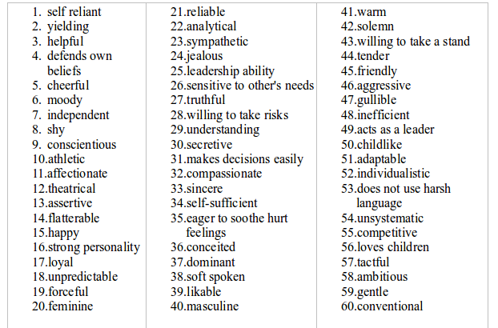
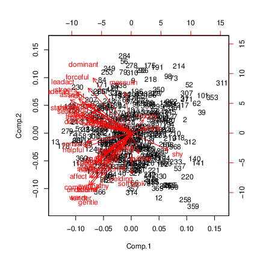

##  Principal components and factor analysis


* Principal components: 


  * Purely mathematical.

  * Find eigenvalues, eigenvectors of correlation matrix.

  * No testing whether observed components reproducible, or even probability model behind it.


* Factor analysis: 


  * some way towards fixing this (get test of appropriateness)

  * In factor analysis, each variable modelled as: "common factor" (eg. verbal ability) and "specific factor" (left over).

  * Choose the common factors to "best" reproduce pattern seen in correlation matrix.

  * Iterative procedure, different answer from principal components.


##  Packages
```{r eval=F, warning=F, message=F}
library(lavaan) # for confirmatory, later
library(ggbiplot)
library(tidyverse)
```

   


##  Example


* 
145 children given 5 tests, called PARA, SENT, WORD, ADD and DOTS. 3 linguistic tasks (paragraph comprehension, sentence completion  and word meaning), 2 mathematical ones (addition and counting dots).

* Correlation matrix of scores on the tests:


```

para 1     0.722 0.714 0.203 0.095
sent 0.722 1     0.685 0.246 0.181
word 0.714 0.685 1     0.170 0.113
add  0.203 0.246 0.170 1     0.585
dots 0.095 0.181 0.113 0.585 1

```


* Is there small number of underlying "constructs" (unobservable) that explains this pattern of correlations?


##  To start: principal components

Using correlation matrix. Read that first:

```{r kids-scree,message=F}
my_url <- "http://www.utsc.utoronto.ca/~butler/d29/rex2.txt"
kids <- read_delim(my_url, " ")
kids
```

## Principal components on correlation matrix

```{r}
kids %>%
  select(where(is.numeric)) %>%
  as.matrix() %>%
  princomp(covmat = .) -> kids.pc
```


##  Scree plot
```{r fig.height=3.5}
ggscreeplot(kids.pc)
```

   


##  Principal component results


* Need 2 components. Loadings:

\footnotesize
```{r}
kids.pc$loadings
```
\normalsize

## Comments

* First component has a bit of everything, though especially the
first three tests.

* Second component rather more clearly `add` and `dots`.

* No scores, plots since no actual data.


##  Factor analysis


* Specify number of factors first, get solution with exactly
that many factors.

* Includes hypothesis test, need to specify how many children
wrote the tests.

* Works from correlation matrix via `covmat` or actual
data, like `princomp`.

* Introduces extra feature, *rotation*, to make
interpretation of loadings (factor-variable relation) easier.


##  Factor analysis for the kids data


* Create "covariance list" to include number of children who
wrote the tests.

* Feed this into `factanal`, specifying how many factors (2).

```{r }
km <- kids %>%
  select(where(is.numeric)) %>%
  as.matrix()
km2 <- list(cov = km, n.obs = 145)
kids.f2 <- factanal(factors = 2, covmat = km2)
```

   


##  Uniquenesses

```{r }
kids.f2$uniquenesses
```


* Uniquenesses say how "unique" a variable is (size of
specific factor). Small
uniqueness means that the variable is summarized by a factor (good).

* Very large uniquenesses are bad; `add`'s uniqueness is largest but not large enough to be worried about.

* Also see "communality" for this idea, where *large* is good and *small* is bad.


##  Loadings

\footnotesize
```{r}
kids.f2$loadings
```
\normalsize

* Loadings show how each factor depends on variables. Blanks
indicate "small", less than 0.1.

## Comments

* Factor 1 clearly the "linguistic" tasks, factor 2 clearly
the "mathematical" ones.

* Two factors together explain 68\% of variability (like
regression R-squared).
    
- Which variables belong to which factor is *much* clearer than with principal components.

##  Are 2 factors enough? 
```{r }
kids.f2$STATISTIC
kids.f2$dof
kids.f2$PVAL
```

   

P-value not small, so 2 factors OK.


##  1 factor

```{r }
kids.f1 <- factanal(factors = 1, covmat = km2)
kids.f1$STATISTIC
kids.f1$dof
kids.f1$PVAL
```

   

1 factor rejected (P-value small). Definitely need more than 1.


##  Track running records revisited

Read the data, run principal components, get biplot: 

```{r, message=FALSE}
my_url <- "http://www.utsc.utoronto.ca/~butler/d29/men_track_field.txt"
track <- read_table(my_url)
track %>% select(where(is.numeric)) -> track_num
track.pc <- princomp(track_num, cor = T)
g2 <- ggbiplot(track.pc, labels = track$country)
```

## The biplot

```{r fig.height=3.7}
g2
```

   


##  Benefit of rotation


* 100m and marathon arrows almost perpendicular, but components
don't match anything much:


* sprinting: bottom left and top right

* distance running: top left and bottom right.


* Can we arrange things so that components (factors) correspond
to something meaningful?


##  Track records by factor analysis
Obtain factor scores (have actual data):

\normalsize
```{r track-factor-biplot}
track %>%
  select(where(is.numeric)) %>%
  factanal(2, scores = "r") -> track.f
```
\normalsize
   


##  Track data biplot
Not so nice-looking:  
```{r siracusa,fig.height=3.5}
biplot(track.f$scores, track.f$loadings,
  xlabs = track$country
)
```

   


##  Comments


* This time 100m "up" (factor 2), marathon "right" (factor 1).

* Countries most negative on factor 2 good at sprinting.

* Countries most negative on factor 1 good at distance running.


##  Rotated factor loadings
\small
```{r }
track.f$loadings
```
\normalsize


## Which countries are good at sprinting or distance running?

Make a data frame with the countries and scores in:

```{r }
scores <- data.frame(
  country = track$country,
  track.f$scores
)
scores %>% slice(1:6)
```

 


##  The best sprinting countries
Most negative on factor 2:

```{r message=F, include=F}
my_url <- "http://www.utsc.utoronto.ca/~butler/d29/isocodes.csv"
iso <- read_csv(my_url)
iso
```


\footnotesize
```{r, warning=F}
scores %>%
  arrange(Factor2) %>%
  left_join(iso, by = c("country" = "ISO2")) %>%
  select(Country, Factor1, Factor2) %>%
  slice(1:10)
```
\normalsize
 


##  The best distance-running countries
Most negative on factor 1:

\footnotesize
```{r, warning=F}
scores %>%
  arrange(Factor1) %>%
  left_join(iso, by = c("country" = "ISO2")) %>%
  select(Country, Factor1, Factor2) %>%
  slice(1:10)
```
\normalsize
 

##  A bigger example: BEM sex role inventory


* 369 women asked to rate themselves on 60 traits, like "self-reliant" or "shy".

* Rating 1 "never or almost never true of me" to 7 ``always or
almost always true of me''.

* 60 personality traits is a lot. Can we find a smaller number
of factors that capture aspects of personality?

* The whole BEM sex role inventory on next page.


##  The whole inventory


{width=450px}


##  Some of the data


\scriptsize
```{r bem-scree, message=F}
my_url <- "http://www.utsc.utoronto.ca/~butler/d29/factor.txt"
bem <- read_tsv(my_url)
bem
```
\normalsize
   


##  Principal components first
\ldots to decide on number of factors:
```{r }
bem.pc <- bem %>%
  select(-subno) %>%
  princomp(cor = T)
```

   


##  The scree plot
```{r genoa,fig.height=3.7}
(g <- ggscreeplot(bem.pc))
```

 


* No obvious elbow.
  


##  Zoom in to search for elbow

Possible elbows at 3 (2 factors) and 6 (5):

```{r bem-scree-two,fig.height=3.3,warning=F}
g + scale_x_continuous(limits = c(0, 8))
```


##  but is 2 really good?

\scriptsize
```{r }
summary(bem.pc)
```
\normalsize


##  Comments


* Want overall fraction of variance explained (``cumulative
proportion'') to be reasonably high.

* 2 factors, 28.5\%. Terrible!

* Even 56\% (10 factors) not that good!

* Have to live with that.


##  Biplot

```{r bem-biplot,fig.height=3.5}
ggbiplot(bem.pc, alpha = 0.3)
```
  



##  Comments


* Ignore individuals for now.

* Most variables point to 10 o'clock or 7 o'clock.

* Suggests factor analysis with rotation will get interpretable
factors (rotate to 6 o'clock and 9 o'clock, for example).

* Try for 2-factor solution (rough interpretation, will be bad):

```{r }
bem.2 <- bem %>%
  select(-subno) %>%
  factanal(factors = 2)
```


* Show output in pieces (just print `bem.2` to see all of it).


##  Uniquenesses, sorted

\scriptsize
```{r, echo=-1}
options(width = 60)
sort(bem.2$uniquenesses)
```
\normalsize
   
## Comments

* Mostly high or very high (bad).

* Some smaller, eg.: Leadership ability (0.409),
Acts like leader (0.417),
Warm (0.476),
Tender (0.493).

* Smaller uniquenesses captured by one of our two factors.

- Larger uniquenesses are not: need more factors to capture them.


##  Factor loadings, some

\scriptsize
```{r}
bem.2$loadings
```
\normalsize


##  Making a data frame
There are too many to read easily, so make a data frame. A
bit tricky:

\footnotesize
```{r}
loadings <- as.data.frame(unclass(bem.2$loadings)) %>%
  mutate(trait = rownames(bem.2$loadings))
loadings %>% slice(1:12)
```
\normalsize
   


##  Pick out the big ones on factor 1

Arbitrarily defining $>0.4$ or $<-0.4$ as "big":

\scriptsize
```{r}
loadings %>% filter(abs(Factor1) > 0.4) 
```
\normalsize


##  Factor 2, the big ones

\footnotesize
```{r}
loadings %>% filter(abs(Factor2) > 0.4)
```
\normalsize
   


##  Plotting the two factors
- A bi-plot, this time with the variables reduced in size. Looking for
unusual individuals.

- Have to run `factanal` again to get factor scores for plotting.

```{r biplot-two-again, eval=F}
bem %>% select(-subno) %>% 
  factanal(factors = 2, scores = "r") -> bem.2a
biplot(bem.2a$scores, bem.2a$loadings, cex = c(0.5, 0.5))
```

 

- Numbers on plot are row numbers of `bem`
data frame.


##  The (awful) biplot

```{r biplot-two-ag,fig.height=4,echo=F}
bem.2a <- factanal(bem[, -1], factors = 2, scores = "r")
biplot(bem.2a$scores, bem.2a$loadings, cex = c(0.5, 0.5))
```

 


##  Comments


* Variables mostly up ("feminine") and right ("masculine"),
accomplished by rotation.

* Some unusual individuals: 311, 214 (low on factor 2), 366
(high on factor 2),
359, 258
(low on factor 1), 230 (high on factor 1).


##  Individual 366

\tiny
```{r}
bem %>% slice(366) %>% glimpse()
```
\normalsize

## Comments


* Individual 366 high on factor 2, but hard to see which traits should have high scores
(unless we remember).

* Idea: *tidy* original data frame to make easier to look
things up.


##  Tidying original data

\scriptsize
```{r}
bem %>%
  mutate(row = row_number()) %>%
  pivot_longer(c(-subno, -row), names_to="trait", 
               values_to="score") -> bem_tidy
bem_tidy
```
\normalsize
   


##  Recall data frame of loadings

\footnotesize
```{r}
loadings %>% slice(1:10)
```
\normalsize
   

Want to add the factor scores for each trait to our tidy data frame
`bem_tidy`. This is a left-join (over), matching on the column
`trait` that is in both data frames (thus, the default):


##  Looking up loadings

\scriptsize
```{r}
bem_tidy %>% left_join(loadings) -> bem_tidy
bem_tidy %>% sample_n(12)
```
\normalsize
   


##  Individual 366, high on Factor 2
So now pick out the rows of the tidy data frame that belong to
individual 366 (`row=366`) and for which the `Factor2`
score exceeds 0.4 in absolute value (our "big" from before):

\scriptsize
```{r}
bem_tidy %>% filter(row == 366, abs(Factor2) > 0.4)
```
\normalsize
 
As expected, high scorer on these.


##  Several individuals
Rows 311 and 214 were *low* on Factor 2, so their scores should
be low. Can we do them all at once?

\footnotesize
```{r}
bem_tidy %>% filter(
  row %in% c(366, 311, 214),
  abs(Factor2) > 0.4
)
```
\normalsize
   

Can we display each individual in own column?


##  Individual by column
Un-`tidy`, that is, `pivot_wider`:

\tiny
```{r}
bem_tidy %>%
  filter(
    row %in% c(366, 311, 214),
    abs(Factor2) > 0.4
  ) %>%
  select(-subno, -Factor1, -Factor2) %>%
  pivot_wider(names_from=row, values_from=score)
```
\normalsize
 
366 high, 311 middling, 214 (sometimes) low.


##  Individuals 230, 258, 359
These were high, low, low on factor 1. Adapt code:

\tiny
```{r}
bem_tidy %>%
  filter(row %in% c(359, 258, 230), abs(Factor1) > 0.4) %>%
  select(-subno, -Factor1, -Factor2) %>%
  pivot_wider(names_from=row, values_from=score)
```
\normalsize
 


##  Is 2 factors enough?
Suspect not:
```{r }
bem.2$PVAL
```

   

2 factors resoundingly rejected. Need more. Have to go all the way to
15 factors to not reject:

```{r }
bem.15 <- bem %>%
  select(-subno) %>%
  factanal(factors = 15)
bem.15$PVAL
```

 

Even then, only just over 50\% of variability explained.

Let's have a look at the important things in those 15 factors.


##  Get 15-factor loadings
into a data frame, as before:  

\small
```{r}
loadings <- as.data.frame(unclass(bem.15$loadings)) %>%
  mutate(trait = rownames(bem.15$loadings))
```
\normalsize
   

then show the highest few loadings on each factor.


##  Factor 1 (of 15)

\footnotesize
```{r}
loadings %>%
  arrange(desc(abs(Factor1))) %>%
  select(Factor1, trait) %>%
  slice(1:10)
```
\normalsize
   
Compassionate, understanding, sympathetic, soothing: thoughtful of
others. 


##  Factor 2

\footnotesize
```{r}
loadings %>%
  arrange(desc(abs(Factor2))) %>%
  select(Factor2, trait) %>%
  slice(1:10)
```
\normalsize
   

Strong personality, forceful, assertive, dominant: getting ahead. 


##  Factor 3

\footnotesize
```{r}
loadings %>%
  arrange(desc(abs(Factor3))) %>%
  select(Factor3, trait) %>%
  slice(1:10)
```
\normalsize
   

Self-reliant, self-sufficient, independent: going it alone.


##  Factor 4

\footnotesize
```{r}
loadings %>%
  arrange(desc(abs(Factor4))) %>%
  select(Factor4, trait) %>%
  slice(1:10)
```
\normalsize
   

Gentle, tender, warm (affectionate): caring for others.


##  Factor 5

\footnotesize
```{r}
loadings %>%
  arrange(desc(abs(Factor5))) %>%
  select(Factor5, trait) %>%
  slice(1:10)
```
\normalsize
   

Ambitious, competitive (with a bit of risk-taking and individualism):
Being the best.


##  Factor 6

\footnotesize
```{r}
loadings %>%
  arrange(desc(abs(Factor6))) %>%
  select(Factor6, trait) %>%
  slice(1:10)
```
\normalsize
   

Acts like a leader, leadership ability (with a bit of Dominant):
Taking charge.


##  Factor 7

\footnotesize
```{r}
loadings %>%
  arrange(desc(abs(Factor7))) %>%
  select(Factor7, trait) %>%
  slice(1:10)
```
\normalsize
   

Acts like a leader, leadership ability (with a bit of Dominant):
Taking charge.


##  Factor 8

\footnotesize
```{r}
loadings %>%
  arrange(desc(abs(Factor8))) %>%
  select(Factor8, trait) %>%
  slice(1:10)
```
\normalsize
   
Affectionate, flattering: Making others feel good.


##  Factor 9

\footnotesize
```{r}
loadings %>%
  arrange(desc(abs(Factor9))) %>%
  select(Factor9, trait) %>%
  slice(1:10)
```
\normalsize
   

Taking a stand.


##  Factor 10

\footnotesize
```{r}
loadings %>%
  arrange(desc(abs(Factor10))) %>%
  select(Factor10, trait) %>%
  slice(1:10)
```
\normalsize

   

Feminine. (A little bit of not-masculine!)


##  Factor 11

\footnotesize
```{r}
loadings %>%
  arrange(desc(abs(Factor11))) %>%
  select(Factor11, trait) %>%
  slice(1:10)
```
\normalsize
   

Loyal.


##  Factor 12

\footnotesize
```{r}
loadings %>%
  arrange(desc(abs(Factor12))) %>%
  select(Factor12, trait) %>%
  slice(1:10)
```
\normalsize
   

Childlike. (With a bit of moody, shy, not-self-sufficient, not-conscientious.)


##  Factor 13

\footnotesize
```{r}
loadings %>%
  arrange(desc(abs(Factor13))) %>%
  select(Factor13, trait) %>%
  slice(1:10)
```
\normalsize
   

Truthful. (With a bit of happy and not-gullible.)


##  Factor 14
\footnotesize

```{r}
loadings %>%
  arrange(desc(abs(Factor14))) %>%
  select(Factor14, trait) %>%
  slice(1:10)
```
\normalsize
   

Decisive. (With a bit of self-sufficient and not-soft-spoken.)


##  Factor 15
\footnotesize
```{r}
loadings %>%
  arrange(desc(abs(Factor15))) %>%
  select(Factor15, trait) %>%
  slice(1:10)
```
\normalsize
   

Not-compassionate, athletic, sensitive: A mixed bag. ("Cares about self"?)


##  Anything left out? Uniquenesses

\scriptsize
```{r}
enframe(bem.15$uniquenesses, name="quality", value="uniq") %>%
  arrange(desc(uniq)) %>%
  slice(1:10)
```
\normalsize
   

Uses foul language especially, also loves children and analytical. So
could use even more factors.


# Confirmatory factor analysis}

##  Confirmatory factor analysis


* Exploratory: what do data suggest as hidden underlying factors (in terms of variables observed)?

* Confirmatory: have *theory* about how underlying factors depend on observed variables; test whether theory supported by data:


* does theory provide *some* explanation (better than nothing)

* can we do better?


* Also can compare two theories about factors: is more complicated one significantly better than simpler one?


##  Children and tests again


* Previously had this correlation matrix of test scores (based on 145
children):

```{r }
km
```
 


* Will use package `lavaan` for confirmatory analysis.

* Can use actual data or correlation matrix.

* Latter (a bit) more work, as we see.


##  Two or three steps


* Make sure correlation matrix (if needed) is handy.

* Specify factor model (from theory)

* Fit factor model: does it fit acceptably? 

## Terminology

* Thing you cannot observe called **latent variable**.

* Thing you *can* observe called **manifest variable**.

* Model predicts latent variables from manifest variables.
  - asserts a relationship between latent and manifest.

- We need to invent names for the latent variables.


##  Specifying a factor model


* Model with one factor including all the tests:
```{r }
test.model.1 <- "ability=~para+sent+word+add+dots"
```
 


* and a model that we really believe, that there are two factors,
a verbal and a mathematical:
```{r }
test.model.2 <- "verbal=~para+sent+word
                 math=~add+dots"
```
 

* Note the format: really all one line between single quotes, but
putting it on several lines makes the layout clearer.

* Also note special notation `=~` for ``this latent
variable depends on these observed variables''.  


##  Fitting a 1-factor model


* Need to specify model, correlation matrix, $n$ like this:

```{r }
fit1 <- cfa(test.model.1,
  sample.cov = km,
  sample.nobs = 145
)
```
 


* Has `summary`, or briefer version like this:

\scriptsize
```{r}
fit1
```
\normalsize

* Test of fit: null "model fits" *rejected*. We can do better.


##  Two-factor model

\scriptsize
```{r}
fit2 <- cfa(test.model.2, sample.cov = km, sample.nobs = 145)
fit2
```
\normalsize


* This fits OK: 2-factor model supported by the data.

* 1-factor model did not fit. We really need 2 factors.

* Same conclusion as from `factanal` earlier.


##  Comparing models


* Use `anova` as if this were a regression:

\scriptsize
```{r}
anova(fit1, fit2)
```
\normalsize


* 2-factor model fits significantly better than 1-factor.

* No surprise!


##  Track and field data, yet again


* `cfa` works easier on actual data, such as the running records:

\footnotesize
```{r}
track %>% print(n = 6)
```
\normalsize


* Specify factor model. Factors seemed to be "sprinting" (up to
800m) and "distance running" (beyond):

\footnotesize
```{r}
track.model <- "sprint=~m100+m200+m400+m800
                distance=~m1500+m5000+m10000+marathon"
```
\normalsize


##  Fit and examine the model


* Fit the model. The observed variables are on different
scales, so we should standardize them first via `std.ov`:

\scriptsize
```{r}
track.1 <- track %>%
  select(-country) %>%
  cfa(track.model, data = ., std.ov = T)
track.1
```
\normalsize


* This fits badly. Can we do better?

* Idea: move middle distance races (800m, 1500m) into a third factor.


##  Factor model 2


* Define factor model:

```{r }
track.model.2 <- "sprint=~m100+m200+m400
                  middle=~m800+m1500
                  distance=~m5000+m10000+marathon"
```
 


* Fit:

```{r}
track %>%
  select(-country) %>%
  cfa(track.model.2, data = ., std.ov = T) -> track.2
```

## Examine

```{r}
track.2
```


* Fits  marginally better, though still badly.


##  Comparing the two models


* Second model doesn't fit well, but is it better than first?

\footnotesize
```{r}
anova(track.1, track.2)
```
\normalsize

* Oh yes, a lot better.


