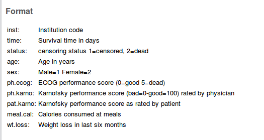

## Survival analysis


* So far, have seen:


   * response variable counted or measured (regression)

   * response variable categorized (logistic regression)

and have predicted response from explanatory variables.

* But what if response is time until event (eg. time of
survival after surgery)?

* Additional complication: event might not have happened at end of study (eg. patient still alive). But knowing that patient has "not died yet" presumably informative. Such data called *censored*. 

* Enter *survival analysis*, in particular the "Cox proportional hazards model". 

* Explanatory variables in this context often called *covariates*.


## Example: still dancing?


* 12 women who have just started taking dancing lessons are
followed for up to a year, to see whether they are still taking
dancing lessons, or have quit. The "event" here is "quit".

* This might depend on:


   * a treatment (visit to a dance competition)

   * woman's age (at start of study).

## Data

\normalsize
```
Months  Quit   Treatment Age
1        1        0      16
2        1        0      24
2        1        0      18
3        0        0      27
4        1        0      25
7        1        1      26
8        1        1      36
10       1        1      38
10       0        1      45
12       1        1      47
```
\normalsize

## About the data


* `months` and `quit` are kind of combined response:


   *  `Months` is number of months a woman was actually observed dancing

   * `quit` is 1 if woman quit, 0 if still dancing at end of study.


* Treatment is 1 if woman went to dance competition, 0 otherwise.

* Fit model and see whether `Age` or `Treatment`
have effect on survival.

* Want to do predictions for probabilities of still dancing as
they depend on whatever is significant, and draw plot.

## Packages (for this section) 

* Install packages `survival` and `survminer` if not done. 

* Load `survival`, `survminer`,
`broom` and `tidyverse`:

```{r, eval=F}
library(tidyverse)
library(survival)
library(survminer)
library(broom)
```


## Read data 


- Column-aligned: 

\normalsize
```{r}
url <- "http://www.<utsc.utoronto.ca/~butler/d29/dancing.txt"
# url <- "dancing.txt"
dance <- read_table(url)
```
\normalsize


## The data

\small
```{r}
dance
```
\normalsize
   

## Examine response and fit model


* Response variable: 

\small
```{r}
dance %>% mutate(mth = Surv(Months, Quit)) -> dance
dance
```
\normalsize


  

* Then fit model, predicting `mth` from explanatories:
```{r }
dance.1 <- coxph(mth ~ Treatment + Age, data = dance)
```
 


## Output looks a lot like regression

\scriptsize
```{r}
summary(dance.1)
```
\normalsize

## Conclusions


* Use $\alpha=0.10$ here since not much data.

* Three tests at bottom like global F-test. Consensus that
something predicts survival time (whether or not dancer quit and how
long it took).

* `Age` (definitely), `Treatment` (marginally) both
predict survival time.


## Model checking


* With regression, usually plot residuals against fitted values.

* Not quite same here (nonlinear model), but ``martingale
residuals'' should have no pattern vs.\ "linear predictor".

* `ggcoxdiagnostics` from package `survminer`
makes plot, to which we add smooth. If smooth trend more or less
straight across, model OK. 

* Martingale residuals can go very negative, so won't always
look normal.


## Martingale residual plot for dance data

This looks good (with only 12 points):

```{r fig.height=3}
ggcoxdiagnostics(dance.1) + geom_smooth(se = F)
```

   

## Predicted survival probs 
- The function we use is called
`survfit`, though actually works rather like
`predict`. 
- First create a data frame of values to predict from. We'll do all
combos of ages 20 and 40, treatment and not, using
`crossing` to get all the combos:

\small
```{r}
treatments <- c(0, 1)
ages <- c(20, 40)
dance.new <- crossing(Treatment = treatments, Age = ages)
dance.new
```
\normalsize 

## The predictions  
One prediction *for each time* for each combo of age and treatment in `dance.new`:

```{r echo=F}
options(width = 80)
```


\footnotesize
```{r}
s <- survfit(dance.1, newdata = dance.new, data = dance)
summary(s)
```
\normalsize


## Conclusions from predicted probs


* Older women more likely to be still dancing than younger women
(compare "profiles" for same treatment group).

* Effect of treatment seems to be to increase prob of still
dancing (compare "profiles" for same age for treatment group
vs.\ not)

* Would be nice to see this on a graph. This is `ggsurvplot` from package `survminer`:
```{r }
# s1 <- do.call(survfit, list(formula=dance.1, 
#                             newdata=dance.new, 
#                             data=dance))
# g <- ggsurvplot(s1, conf.int = F)
g <- ggsurvplot(s, conf.int = F)
```

## "Strata" (groups)

- uses "strata" thus (`dance.new`): 

\footnotesize

```{r, echo=F}
dance.new
```
\normalsize


## Plotting survival probabilities 
```{r survival-plot, fig.height=3.8}
g
```

   

## Discussion 


* Survivor curve farther to the right is better (better chance
of surviving longer).

* Best is age 40 with treatment, worst age 20 without.

* Appears to be: 


   * age effect (40 better than 20)

   * treatment effect (treatment better than not)


   * In analysis, treatment effect only marginally significant.


## A more realistic example: lung cancer


* When you
load in an R package, get data sets to illustrate 
functions in the package. 

* One such is `lung`. Data
set measuring survival in patients with advanced lung cancer. 

* Along with survival time, number of "performance scores"
included, measuring how well patients can perform daily
activities.

* Sometimes high good, but sometimes bad!

* Variables below,
from the data set help file  (`?lung`).


## The variables


  

## Uh oh, missing values

\scriptsize
```{r}
lung 
```
\normalsize
       

## A closer look 


```{r echo=F}
options(width = 90)
```


\tiny
 
```{r}
summary(lung)
```
\normalsize

   

## Remove obs with *any* missing values 

\small
```{r}
lung %>% drop_na() -> lung.complete
lung.complete
```
\normalsize


   
Missing values seem to be gone.

## Check! 
\tiny
```{r}
summary(lung.complete)
```
\normalsize


   
No missing values left.

## Model 1: use everything except `inst`
\footnotesize
```{r}
names(lung.complete)
```
\normalsize

- Event was death, goes with `status` of 2:
 
```{r }
lung.complete %>% 
   mutate(resp = Surv(time, status == 2)) ->
   lung.complete
lung.complete
lung.1 <- coxph(resp ~ . - inst - time - status,
  data = lung.complete
)
```
 
"Dot" means "all the other variables".

## `summary` of model 1: too tiny to see! 
\tiny
```{r}
summary(lung.1)
```
\normalsize

 

## Overall significance
The three tests of overall significance: 
\small
```{r}
glance(lung.1) %>% select(starts_with("p.value"))
```
\normalsize

 
All strongly significant. *Something* predicts survival. 


## Coefficients for model 1 
\small
```{r }
tidy(lung.1) %>% select(term, p.value) %>% arrange(p.value)
```
\normalsize

 


* `sex` and
`ph.ecog` definitely significant here 

* `age`, `pat.karno` and
`meal.cal` definitely not

* Take out definitely non-sig variables, and try again.


## Model 2
\normalsize
```{r}
lung.2 <- update(lung.1, . ~ . - age - pat.karno - meal.cal)
tidy(lung.2) %>% select(term, p.value)
```
\normalsize

## Compare with first model: 

\normalsize

```{r}
anova(lung.2, lung.1)
```
\normalsize


       

* No harm in taking out those variables.


## Model 3 

Take out `ph.karno` and `wt.loss` as well. 


```{r}
lung.3 <- update(lung.2, . ~ . - ph.karno - wt.loss)
```
 
```{r tidy-lung-3}
tidy(lung.3) %>% select(term, estimate, p.value)
```
 

## Check whether that was OK

```{r}
anova(lung.3, lung.2)
```

*Just* OK. 


## Commentary


* OK (just) to take out those two covariates.

* Both remaining variables strongly significant.

* Nature of effect on survival time? Consider later. 

* Picture?


## Plotting survival probabilities


* Create new data frame of values to predict for, then predict:

\footnotesize
```{r}
sexes <- c(1, 2)
ph.ecogs <- 0:3
lung.new <- crossing(sex = sexes, ph.ecog = ph.ecogs)
lung.new
```
\normalsize

 


## Making the plot 
```{r fig.height=3.2}
s <- survfit(lung.3, data = lung.complete, newdata = lung.new)
ggsurvplot(s, conf.int = F)
```
 
## The plot

```{r, fig.height=3.8}
g
```


## Discussion of survival curves


* Best survival is teal-blue curve, stratum 5, females with
`ph.ecog` score 0.

* Next best: blue, stratum 6, females with score 1, and
red, stratum 1, males score 0.

* Worst: green, stratum 4, males score 3.

* For any given `ph.ecog` score, females have better
predicted survival than males.

* For both genders, a lower score associated with better
survival.

## The coefficients in model 3 

```{r ref.label="tidy-lung-3"}
```


* `sex` coeff negative, so being higher
`sex` value (female) goes with *less* hazard of dying.

* `ph.ecog` coeff positive, so higher
`ph.ecog` score goes with *more* hazard of dying

* Two coeffs about same size, so being male rather than female
corresponds to 1-point increase in `ph.ecog` score. Note
how survival curves come in 3 pairs plus 2 odd.


## Martingale residuals for this model
No problems here:

```{r fig.height=3}
ggcoxdiagnostics(lung.3) + geom_smooth(se = F)
```

   

## When the Cox model fails


* Invent some data where survival is best at middling age, and
worse at high *and* low age:
```{r }
age <- seq(20, 60, 5)
survtime <- c(10, 12, 11, 21, 15, 20, 8, 9, 11)
stat <- c(1, 1, 1, 1, 0, 1, 1, 1, 1)
d <- tibble(age, survtime, stat)
d %>% mutate(y = Surv(survtime, stat)) -> d
d
```

     

* Small survival time 15 in middle was actually censored, so would
have been longer if observed.


## Fit Cox model 

\footnotesize

```{r }
y.1 <- coxph(y ~ age, data = d)
summary(y.1)
```
\normalsize

   

## Martingale residuals 

Down-and-up indicates incorrect relationship between age and
survival: 

```{r fig.height=3.4, message=F}
ggcoxdiagnostics(y.1) + geom_smooth(se = F)
```

   

## Attempt 2

Add squared term in age:


```{r}
y.2 <- coxph(y ~ age + I(age^2), data = d)
tidy(y.2) %>% select(term, estimate, p.value)
```

- (Marginally) helpful.
       

## Martingale residuals this time 

Not great, but less problematic than before:

```{r fig.height=3.2, message=F}
ggcoxdiagnostics(y.2) + geom_smooth(se = F)
```

   


