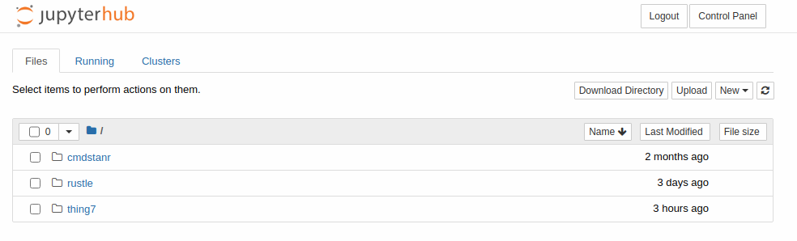
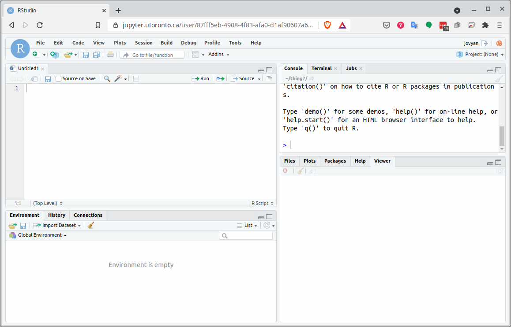

## Running R online

Go to [https://jupyter.utoronto.ca](https://jupyter.utoronto.ca). 

You want to see this:

{height=50%}

If you do, find the line that says "after logging in, open" and click the button next to R Studio to make it blue. Then click the orange Log In to Start, and log in with UTorID and password.

## Next

You'll see something that looks like this, with some files (maybe):

{height=50%}

Click on New, on the right. From the dropdown, select R Studio (near the bottom).

## How R Studio looks

## Projects

- Each user has a “workspace”, a place where all your work is
stored.
- Within that workspace, you can have as many Projects as you like.
- To create a new Project, click on the blue New Project button.
- I recommend having one project per *course*.
- R Studio restarts where you left off.

## Make a new project

- Call it what you like. Mine is called `thing7`:
- Select: 
  - File, 
  - New Project, 
  - New Directory,
  - New Project (again),
  - give it a name and click Create Project.
- You see the name of your new project top right.

## R Notebooks

- At top right of previous view is Console, where you can enter R commands
and see output.
- A better way to work is via “R Notebooks”. These allow you to
combine narrative, code and output in one document.
- Data analysis is always a story: not only what you did, but why you
did it, with the “why” being more important.
- To create a new notebook, select File, New File, R Notebook. This
brings up an example notebook as over.
- The next example was done in another online environment, so looks (slightly) different, but will still work for you.

## The template R Notebook
  

## About this notebook

- The notebook begins with a title (that you can change).
- Most of this notebook is text (narrative). The stuff with
`*asterisks*` around it will come out in italics in the final document.
- Pieces beginning with three "backticks" and `{r}`, in grey, are called code chunks. They
contain R code. Three more backticks marks the end of a code chunk.
- Run code chunks by clicking on the green “play button” at the top
right of the chunk. This one makes a scatterplot. If you click the play
button, the plot is made and placed under the code, as over.

## After running the code chunk
  
  
  
## Making our own notebook

- Create another new notebook. Delete the template text and change
the title to “Some random normal data”.
- Type `## Packages` and go down a couple of lines.
- Make a new code chunk by clicking Insert (at the top of the notebook
window) and selecting R. Inside that chunk, type
`library(tidyverse)`.
- Below that, type `## Random normal data`.
- Make another new code chunk below that, and insert two lines of
code: `z=rnorm(100)` and then `z`.
- Below that, type text `## A histogram` and a code chunk containing
`ggplot(tibble(z),aes(x=z))+geom_histogram(bins=10)`.

## My R notebook

  
## Run the chunks

- Now run each of the three chunks in order. You’ll see output below
each one, including a histogram below the last one.
- When it works, add some narrative text before the code chunks
explaining what is going to be done, and some text after describing
what you see.
- Save the notebook (File, Save As). You don’t need a file extension.
- Click Preview. This makes an HTML-formatted report. (The first
may be gibberish: ignore that). Note what happened to the text.
- If you want to edit anything, go back to the R Notebook, change it,
save it, and run Preview again.

## The end of my (formatted) report

## Installing R on your own computer

- Free, open-source. Download and run on own computer.
- Two things: R itself (install first) and R Studio (front end).
- Go to <https://www.r-project.org/>:

## Click on Download R

- R is stored on numerous “mirrors”, sites around the world. The top
one, “0-Cloud”, picks one for you. Or you can choose one close to
you (might be faster), eg. U of T:

...

## Click your mirror

- Click 0-Cloud or U of T (or other mirror), get:

- Click on your operating system, eg. Windows.

## Click on Base

- Click on “base” here.

## The actual download

- The version number is, as I write this, 4.2.1, but the layout is the same.
- Click something like the top link below:

- Then install usual way.
- Or, for Mac, download and install `R-4-2-1.pkg` (High Sierra) or `R-4.2.1-arm64.pkg` (Big Sur).
- Or, for Linux, click your distribution (eg. Ubuntu), then follow the instructions.

## Now, R Studio

- Go [here](https://www.rstudio.com/). (The word "here" is clickable link.)
- Scroll right down to the bottom, find Products, and click R Studio Desktop.

## Scroll down...

- There are two choices. You want the free one on the left.

- Click left-side Download.

## Find the one for you

- Scroll down to All Installers, and click the installer for your machine
    (Windows, Mac, several flavours of Linux). Install as usual.
    

## Running R

- All of above only done once.
- To run R, run R Studio, which itself runs R.

## How R Studio looks when you run it

{height=200px}

- First time you run R Studio, click on Console window, and, next to the
`>`, type `install.packages("tidyverse")`. Let it do
what it needs to. (You need to do this on your machine. On `jupyter.utoronto.ca`, it's already been done.)

## Projects

- A project is a “container” for code and data that belong together.
- Goes with a folder on some computer.
- File, New Project. You have option to create the new project in a
new folder, or in a folder that already exists.
- Use a project for a collection of work that belongs together, eg. data
files and notebooks for assignments. Putting everything in a project
folder makes it easier to find.
- Example: use a project for (all) assignments, a different notebook
within that project for each one.

